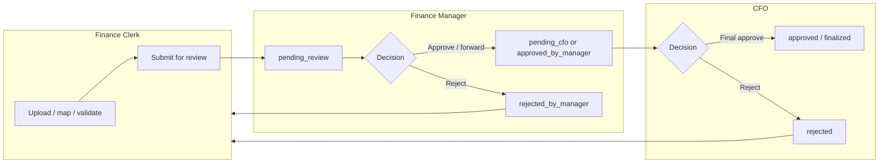

# Approval workflows — Finance Clerk, Finance Manager & CFO

This document describes how **Finance Clerk**, **Finance Manager**, and **CFO** roles move universal-document sessions (balance sheet, income statement, budget report, and related uploads) through preparation, review, and final approval.

---

## Where each role works

| Role | Primary pages | What appears |
|------|----------------|--------------|
| **Finance Clerk** | `/dashboard`, `/upload`, `/mapping`, `/submission-history` | Open periods and tasks; upload/mapping for owned sessions; **Submission history** for own submissions |
| **Finance Manager** | `/finance-manager/review-queue` | Sessions in **`pending_review`** |
| **CFO** | Same URL as manager Review | Sessions in **`pending_cfo`** or **`approved_by_manager`** |
| **Manager & CFO** | `/finance-manager/history` | Settled outcomes (filters as implemented) |
| **Manager & CFO** | `/approvals?review=statement&transaction=<session_id>` | Full-page **statement review** (SFP/SFPER, formula modal). Visiting **`/approvals`** without `review=statement` redirects reviewers back to Review. |

Legacy bookmark **`/finance-manager/dashboard`** redirects to **`/finance-manager/review-queue`**.

---

## End-to-end flow (conceptual)

Exact status strings can vary slightly by document type and backend version. Treat **`pending_review`** as the manager gate and **`pending_cfo`** / **`approved_by_manager`** as the CFO queue.

---

## Finance Clerk

### Purpose

Prepare trial balance data (or equivalent), map accounts where required, satisfy validation rules, then **submit for review** so a Finance Manager can perform quality control and forward toward the CFO where applicable.

### Typical journey

1. **Dashboard (`/dashboard`)** — Open periods and workload; shortcuts to upload or back to work in progress.
2. **Upload (`/upload`)** — Import files (Excel/CSV where enabled). **Hard upload gates** block continue when validation fails:
   - **`balance_sheet`** — debits must equal credits
   - **`income_statement`** — at least one revenue/expense line; if the file has debit/credit columns, debits must equal credits
   - **`budget_report`** — at least one line with budget or actual amounts (variance is expected; GRAP 24 explanations are on the mapping page)
   **GRAP 1 / GRAP 24** mapping checks run again at submit for review.
3. **Mapping (`/mapping?session_id=…`)** — Map accounts to **GRAP-aligned** categories / statement lines for the document type. Users need **process** permission (`can_process`), typically clerks. Complete required mappings before submit. After submit (`pending_review`), mapping, GRAP panels, and variance explanations are **read-only** until rejection/correction.
4. **Submit for review** — From the mapping UI (`static/js/mapping-interface.js`), **`POST /api/submit-mapping`** with `session_id`, `document_type`, and `mapped_data`. Success message: *“Data forwarded to Finance Manager for review.”* Backend re-validates upload rules via **`require_balanced_session`**, then runs **`UniversalWorkflowService.submit_for_review`**, enforces role and **workflow conditions**, and sets **`pending_review`** on success.

### Statuses clerks may submit from

The service allows submission from typical **draft / staging** statuses (for example **`draft`**, **`uploaded`**, **`processing`**, **`mapped`**, **`validated`**) and from **`resubmitted`**, **`rejected`**, or **`rejected_by_manager`** so clerks can fix issues and send again. If the session is already locked (for example **`pending_review`**, **`pending_cfo`**, **`approved`**), submission is rejected until the workflow moves back to an editable state.

### After rejection

When a manager or CFO rejects with reason, the clerk updates data/mappings as needed and **submits for review** again via the same path, subject to status rules above. **View statement** on submission history opens a read-only statement review (same layout as FM/CFO history) without approve/finalize actions.

### Clerk-only navigation (reference)

| Nav / page | Role |
|------------|------|
| **History** (`/submission-history`) | Finance Clerk — own submission trail; **View statement** for read-only review |
| **Upload** | Users with upload permission |

Managers/CFOs use **`/finance-manager/history`** for cross-cutting settled submissions, not the clerk submission-history page.

### Clerk templates & scripts (orientation)

| Step | Templates / scripts (representative) |
|------|-------------------------------------|
| Dashboard | `templates/dashboard.html` |
| Upload | `templates/upload.html`, `static/js/upload.js` |
| Mapping | `templates/mapping_interface.html`, `static/js/mapping-interface.js`, `static/js/mapping-interface-init.js` |
| Submit / status | `static/js/mapping-interface.js` (primary); `static/js/submission-history.js`; `templates/submission-history.html`, `templates/submission_status.html` |

This file is the **single workflow reference** for clerks, managers, and CFOs.

---

## Finance Manager

1. **Queue:** Open **Review** (`/finance-manager/review-queue`) from the nav or the **Dashboard** hero (**View Queue**); **Learn More** on the hero links to About. **Quick Actions** on the dashboard includes **Submission history** only (no duplicate review-queue card; **File Management** is hidden for Finance Manager). The queue loads **`GET /api/transactions/pending`** filtered to **`pending_review`**.
2. **Work:** Use **Review** on a card to open statement review (full-page or inline on the Review page, depending on navigation). Verify lines, formulas, and comments as implemented in the app. For **`budget_report`**, confirm **GRAP 24** variance explanations are present for line items exceeding 10% before forwarding.
3. **Approve:** **`POST /api/universal/approve`** with `session_id` and `document_type` — forwards the workflow toward CFO (session moves out of **`pending_review`**). For **budget reports**, the backend re-validates **GRAP 24** variance explanations at forward time (same gate as clerk submit and CFO finalize). Approve/reject from queue cards is disabled for FM — use statement review.
4. **Reject:** **`POST /api/universal/reject`** with a **mandatory reason** — typically **`rejected_by_manager`** so the clerk can fix and resubmit.
5. **History:** Settled items appear under **`/finance-manager/history`** with filters as implemented.
6. **Approval signatures:** Shown in statement review when `metadata.approval_signatures` is present.
7. **Line-item comments:** During active review (`pending_review`), use the **💬** button on statement rows to add per-account notes (calculation, mapping, data, or general). Comments are stored on `metadata.line_item_comments`, preserved on approve/reject, and visible in:
   - **Statement review** — audit panel grouped by account; **View** (💬) on flagged rows when read-only or settled
   - **FM/CFO History** — open **View Details** → statement review with `returnTo=/finance-manager/history` (read-only)
   - **Clerk submission history** — **View statement** opens read-only review with grouped line-item comments and rejection context

---

## CFO

1. **Queue:** Same **Review** page. The UI filters **`GET /api/transactions/pending`** to **`pending_cfo`** and **`approved_by_manager`**. Queue cards include **Finalize** / **Reject** quick actions; use **Batch finalization** to finalize multiple submissions via **`POST /api/universal/batch-approve`**.
2. **Work:** Same statement review entry points as the manager (session + document type).
3. **Approve:** **`POST /api/universal/approve`** — final approval step for the CFO stage (exact terminal status depends on service rules).
4. **Reject:** **`POST /api/universal/reject`** with reason — returns feedback toward submitter/workflow per backend rules.
5. **History:** Same **`/finance-manager/history`** page. On approved cards, **Finalized export** opens an in-app notice (does not navigate away) so you can keep final-approving other documents; open **Export Center** from the nav when ready to generate PDFs for all finalized submissions.
6. **Approval signatures:** Shown in statement review when prior approvers are recorded.
7. **Line-item comments:** View comments from FM review in statement review and **History** (read-only). CFO may add comments while finalizing; all comments remain on the audit trail after approval.

### CFO batch finalization and export

When finalizing **multiple documents** in one session:

1. **Review** — Approve (or reject) each FM-forwarded submission. The queue count should reach **0**.
2. **History** — Optional: click **Finalized export** on each approved card to acknowledge it is export-ready. Cards fade to **Export noted**; after PDF generation in Export Center they show **PDF exported**.
3. **Export Center** (nav **Export**) — When all approvals are done, select each finalized submission and **Generate PDF** (plus Excel / CSV / archive as needed). FM download depends on CFO generating PDF per session.

**Finalized export** on history cards is an **acknowledgment only** — it does **not** generate a PDF and does **not** deep-link to Export Center. Use the **Export** nav link when you are ready to export everything.

### Finalized export card states (History)

| State | UI | Meaning |
|-------|-----|---------|
| **Finalized export** (button) | Full card | CFO/FM has not acknowledged this finalized submission yet |
| **Export noted** (badge, faded card) | Acknowledged — continue batch review without leaving the page |
| **PDF exported** (badge, more faded) | Official PDF was generated in Export Center (tracked via export log) |

Acknowledgment is stored server-side (`metadata.export_ready_acknowledged_at`) and in the browser session. Re-export from Export Center is always allowed if needed; History simply stops prompting once PDF is logged.

## Shared mechanics

- **Period lock:** After CFO final approval, `financial_periods.is_locked` is set and a global API guard blocks mutating **`POST`/`PUT`/`PATCH`/`DELETE`** on sessions in that period (`utils/period_lock_guard.py`). **CFO finalize is blocked** if no reporting period can be resolved (`period_id_unresolved`) or if the database lock write fails (`period_lock_db_sync_failed`) — finalize only succeeds when `financial_periods.is_locked` is persisted. **Official financial-statement PDF** generation and download require the locked period (`utils/pdf_availability.py`, `utils/pdf_download_guard.py`). Formula-breakdown PDFs and the Manager’s Certificate are **not** gated on period lock (see **PDF and export gates** below).
- **Supabase period-lock migrations:** Run in order in Supabase SQL Editor: `scripts/add_period_lock_and_variance_explanations.sql`, `scripts/enable_financial_periods_cfo_lock_rls.sql` (includes legacy RLS consolidation). Verify with `python scripts/check_supabase_migrations.py` or `GET /api/system/schema-migrations` (CFO / System Admin). Manual audit queries: `scripts/verify_supabase_cfo_migrations.sql`. Expected probe: `financial_periods.is_locked` readable; registry entries for all three migration IDs.
- **GRAP by document type** (`utils/grap_standards_scope.py`, `services/grap_compliance_service.py`):
  - **`budget_report`:** GRAP 24 — mandatory variance explanations when |variance/budget| > 10%. Enforced at **clerk submit**, **FM forward**, and **CFO finalize** (`grap24_variance_explanations` in `UniversalWorkflowService`). The **Budget vs Actual** comparison table and variance panel appear on **`/mapping`** (clerk) and **statement review** (FM/CFO) — there is no separate route; `budget_report` *is* the GRAP 24 statement.
  - **`balance_sheet`:** GRAP 1 (SFP) — mapping complete, trial balance, assets = liabilities + equity.
  - **`income_statement`:** GRAP 1 (performance) — mapping complete, trial balance, revenue/expense structure (no GRAP 24 narratives).
- **Approval:** Use **`GET /api/transactions/pending`**, **`POST /api/universal/approve`** / **`reject`**, and **`POST /api/universal/batch-approve`** (CFO batch finalize on Review page). Legacy `/api/finance-manager/*` routes removed.
- **Preferred APIs:** Upload `POST /api/universal/upload`, GRAP mapping `POST /api/universal/process-grap-mapping`, submit `POST /api/submit-mapping`, approve/reject `POST /api/universal/approve` and `/reject`. Legacy `/api/upload` returns **410**; `/api/processing` delegates to the universal mapping endpoint.
- **Clerk submit:** **`POST /api/submit-mapping`** → **`UniversalWorkflowService.submit_for_review`** (`controllers/routes_universal.py`).
- **Pending queue (reviewers):** **`GET /api/transactions/pending`** — FM/CFO filtering in **`static/js/finance-manager-review-queue.js`**.
- **Approve / reject (reviewers):** **`POST /api/universal/approve`**, **`POST /api/universal/reject`**.
- **Cards:** **`static/js/transaction-card-ui.js`** on FM/CFO Review and History.
- **Statement review:** **`static/js/financial-statement-review.js`** (SFP/SFPER, actions, `returnTo`).
- **Manager’s Certificate:** **`POST /api/certificate/generate/<session_id>`** where enabled after manager approval.
- **Line-item comments:** `GET/POST /api/comments/line-item/<session_id>` — stored on `metadata.line_item_comments`; clerks read own sessions via `process`, reviewers via `review`. **Legacy rejections:** archived comments are resolved from `rejection_history`, `rejection_snapshot`, or the stored rejection reason; eligible sessions are repaired on read (`utils/session_metadata_helpers.py`).
- **Clerk submission list API:** `GET /api/submissions/user` — **Finance Clerk only**; returns lean payloads (counts, status, resolved comments/rejection reason).
- **Status helpers:** **`utils/session_workflow.py`** — submitted-for-review vs clerk-actionable rejection sets.

### Formula transparency (review modal)

During statement review, **calculated cells** open the **formula modal** (`static/js/formula-modal.js`). Copy in the modal stays **user-facing**; implementers use the APIs below.

| Endpoint | Purpose |
|----------|---------|
| **`GET /api/universal/session/<session_id>?document_type=<type>`** | Full **saved session summary** used to render statements and totals: financial statement blocks, metadata (including mappings where stored), row lists (`budget_rows`, `income_rows`, etc.), and session-level aggregates. **`document_type` is required.** |
| **`GET /api/universal/session/<session_id>/formula-breakdown?document_type=<type>`** | Payload for the modal: ordered **steps**, **variables**, and **finalResult**. Query **`scope`**: **`session`** (default, overview), **`calculation`** (with **`calc_id`**), **`line`** (with **`account_code`**, optional **`grap_code`**). |
| **`POST /api/formula/export/formula-breakdown-pdf`** | Download PDF snapshot of the modal breakdown (requires **`review`**, **`final_approve`**, or **`export_audit`**). Implemented in **`controllers/routes_formula.py`**. |

Server-side assembly lives in **`services/session_formula_breakdown.py`** (`build_formula_breakdown_response`), wired from **`controllers/routes_universal.py`**.

**Variable links in the modal** (same origin): **saved submission JSON** uses the session GET URL above; **full-page statement review** uses **`/approvals?review=statement&transaction=<session_id>&type=<document_type>`**, with **`returnTo`** added when opened from the formula modal on Review so **Back** can return to the queue tab where the browser allows **`window.opener`** / **`window.close()`**.

---

## PDF and export gates

Permissions are defined in **`models/supabase_auth_models.py`**. There are **three distinct export paths** — do not confuse them.

### Role × export capability

| Role | Official AFS PDF (`generate_pdf`) | Export Center (`/export`) | Formula breakdown PDF | Manager’s Certificate |
|------|-----------------------------------|---------------------------|------------------------|------------------------|
| **Finance Clerk** | No | No | No | No |
| **Finance Manager** | Download only (`download_pdf`, after lock) | Yes — read-only PDF download | Yes (via review modal) | Yes (after forwarding to CFO) |
| **CFO** | Generate + download (after period lock) | Yes — full (PDF, Excel, CSV, archive) | Yes (via review modal) | No (FM-only) |
| **Auditor** | No | No | Yes (API permission) | No |

### 1. Official financial-statement PDF (CFO generates; FM may download, period-locked)

**Who generates:** CFO only (`generate_pdf` permission).

**Who downloads:** CFO and Finance Manager (`download_pdf` or `generate_pdf`) after period lock.

**When:** Only after the CFO **final-approves** a submission and the linked reporting period is **locked** (`financial_periods.is_locked` or session `metadata.period_locked`).

**Where in the UI:**

| Location | Nav / entry |
|----------|-------------|
| **Export Center** | Nav **Export** → **`/export`** — CFO: generate Excel/CSV/archive/PDF; FM: read-only PDF download |
| **Dashboard** | **Export Center** / **Finalized exports** quick-action card (navigates to `/export`) |
| **Submission history / FM history** | **Finalized export** on approved cards — acknowledgment popup; card fades to **Export noted**, then **PDF exported** after Export Center generation |
| **Results / statement pages** | **Download PDF** on statement pages and **`/results`** (CFO may also **Generate PDF**) |

**Mechanics:**

- UI uses **`static/js/pdf-period-gate.js`**: **`GET /api/pdf/availability`** returns **`can_generate_pdf`** (CFO) and **`can_download_pdf`** (CFO + FM) when the period is locked.
- Session-backed generation: **`POST /api/export/generate-pdf`** (CFO) builds PDF from finalized session summary — no legacy `results_file` required.
- Legacy generation: **`POST /api/generate-pdf`** (CFO, upload flow with `results_file`).
- Structured exports: **`POST /api/export/excel`**, **`/csv`**, **`/archive`** (CFO; CSV also Auditor via `export_audit`).
- Session list: **`GET /api/export/sessions`** — finalized, locked submissions.
- Download: **`/download/<filename>`** — period lock check; any user with **`download_pdf`** may download (not limited to the user who generated the file).
- Front-end wiring: **`static/js/export-center.js`**, **`templates/export.html`**. **`static/js/transaction-card-ui.js`** — **Finalized export** on history cards (acknowledgment, fade states, export log integration).
- Export acknowledgment API: **`POST /api/universal/session/<session_id>/export-acknowledged`**

**Finance Clerk** has no export path. **Auditor** has formula-breakdown PDF only (not official AFS PDF).

### 2. Formula breakdown PDF (reviewers / auditor, not period-locked)

**Who:** Finance Manager, CFO, or Auditor — API requires **`review`**, **`final_approve`**, or **`export_audit`**.

**When:** During statement review (any workflow status where review is allowed). **Does not** require CFO finalization or period lock.

**Where in the UI:**

| Location | How to reach |
|----------|--------------|
| **Review queue / statement review** | **`/finance-manager/review-queue`** or **`/approvals?review=statement&transaction=<id>`** → **View Calculations** (or click a calculated cell) → formula modal → **Export This Breakdown (PDF)** |
| **Formula modal** | Loaded from **`templates/base.html`** when the user has **`review`** or **`export_audit`** |

**API:** **`POST /api/formula/export/formula-breakdown-pdf`** (`controllers/routes_formula.py`).

This is an **audit/transparency** export of calculation steps, not the sealed annual financial statements package.

### 3. Manager’s Certificate (Finance Manager only)

**Who:** Finance Manager only.

**When:** After the manager **approves and forwards** to the CFO (`approved_by_manager` / `pending_cfo`, or `metadata.manager_approval.at` set).

**Where in the UI:**

- **Statement review** header → **Manager’s certificate** button (`static/js/financial-statement-review.js`).
- Optional prompt immediately after FM approve.

**API:** **`POST /api/certificate/generate/<session_id>`** → download via **`/api/certificate/download/<certificate_id>`** (`controllers/routes_certificate.py`). Certificate routes are **exempt** from the period-lock mutation guard.

### Export Center extras (CFO full; FM read-only PDF)

**`/export`** accepts users with **`export`** or **`download_pdf`**. Cards:

| Card | Permission | Period lock? |
|------|------------|--------------|
| PDF Report — Generate | `generate_pdf` (CFO) | Yes |
| PDF Report — Download | `download_pdf` (FM read-only) | Yes |
| Excel Workbook | `export` (CFO) | Enforced via export API on finalized sessions |
| CSV Data | `export_audit` (CFO, Auditor API) | Same |
| Archive Package | `export` (CFO) | Same — ZIP with JSON, CSV, Excel, PDF if present |

Excel, CSV, and Archive are wired via **`controllers/routes_export.py`** and **`services/export_center_service.py`**.

### Workflow nuances (exports)

1. **Clerk has no export path** — prepare and submit only; no PDF or Export nav.
2. **FM can download finalized AFS PDF** after CFO lock (Export Center, history link, statement pages) but cannot generate official PDF or Excel/archive.
3. **CFO unlocks official PDF and structured exports** — period lock is the business gate.
4. **Auditor** has **`export_audit`** for formula-breakdown PDF and CSV API but **no** `/export` page or official AFS PDF.
5. **Two PDF types** — formula breakdown (anytime in review) vs official statements (post–CFO lock).
6. **Upload/submit balance gates** apply to all three document types via **`require_balanced_session`** (balance sheet trial balance; income performance lines ± debit/credit; budget line capture). Official PDF/export still depends on CFO finalization.

---

## Related code (orientation)

| Area | Location |
|------|-----------|
| Clerk dashboard / upload / mapping routes | `controllers/routes.py` (`/dashboard`, `/upload`, `/mapping`, `/submission-history`) |
| Clerk submit API | `POST /api/submit-mapping` in `controllers/routes_universal.py` |
| FM routes & redirects | `controllers/routes_finance_manager.py` |
| Universal workflow | `services/universal_workflow_service.py` |
| Universal approve/reject / pending API | `controllers/routes_universal.py` |
| Clerk submission UI | `static/js/mapping-interface.js`, `static/js/upload.js`, `static/js/submission-history.js`, `templates/mapping_interface.html` |
| FM/CFO Review UI | `templates/finance_manager_review_queue.html`, `static/js/finance-manager-review-queue.js` |
| FM/CFO History UI | `templates/finance_manager_history.html`, `static/js/finance-manager-history.js` |
| Statement review shell | `templates/approvals.html`, `static/js/financial-statement-review.js` |
| Formula modal & session breakdown API | `static/js/formula-modal.js`, `services/session_formula_breakdown.py`, `GET /api/universal/session/...` in `controllers/routes_universal.py` |
| PDF period gate (UI) | `static/js/pdf-period-gate.js`, `GET /api/pdf/availability` in `controllers/routes.py` |
| Official PDF generate/download | `POST /api/generate-pdf`, `/download/<filename>`, `utils/pdf_availability.py`, `utils/pdf_download_guard.py` |
| Export Center page | `templates/export.html`, `/export` in `controllers/routes.py` (CFO-only) |
| Manager’s Certificate | `controllers/routes_certificate.py`, button in `static/js/financial-statement-review.js` |
| Schema migration check | `scripts/check_supabase_migrations.py`, `GET /api/system/schema-migrations`, `services/schema_migration_service.py` |
| Period RLS (Supabase) | `scripts/enable_financial_periods_cfo_lock_rls.sql`, `scripts/consolidate_financial_periods_rls.sql` |
| Line-item comment modal | `templates/components/line-item-comment-modal.html`, `static/js/line-item-comment-system.js` |
| Metadata helpers (legacy comments / counts) | `utils/session_metadata_helpers.py` |

---

## UAT sign-off checklist

Use this checklist for user acceptance testing before production sign-off. Record **Pass / Fail / N/A** and tester initials. Run `python scripts/check_supabase_migrations.py` first — all migrations should report `"all_applied": true`.

### Environment prerequisites

- [ ] Supabase migrations applied (`add_period_lock_and_variance_explanations`, `enable_financial_periods_cfo_lock_rls`, `consolidate_financial_periods_rls`)
- [ ] `python scripts/check_supabase_migrations.py` → `all_applied: true`, probe `financial_periods.is_locked` passed
- [ ] Test users exist for **Finance Clerk**, **Finance Manager**, and **CFO**
- [ ] At least one open reporting period linked to uploads (or date-range resolution works)

### Finance Clerk

| # | Test | Pass |
|---|------|------|
| C1 | Upload **balance sheet** with unbalanced debits/credits — **Continue** disabled | Pass |
| C2 | Upload valid balance sheet → map all accounts → **Submit for review** succeeds | Pass |
| C3 | Success toast: *“Data forwarded to Finance Manager for review.”* | Pass |
| C4 | After submit, mapping and GRAP panels are **read-only** | Pass |
| C5 | Clerk **cannot** see Approve / Finalize on any page | Pass |
| C6 | **Income statement** and **budget report** upload gates behave per doc type | Pass |
| C7 | **Submission history** shows own submissions with correct document-type badge colours | Pass |
| C8 | After FM rejection → **Correct** opens correction workspace with reviewer feedback and per-account comments | Pass |
| C9 | Resubmit requires mandatory clerk note (≥10 chars) + balanced + mapped + GRAP checks | Pass |
| C10 | Clerk **View statement** shows read-only review with line-item comments and rejection context when applicable | Pass |
| C11 | Clerk **View statement** opens read-only statement review (`/approvals?review=statement&returnTo=/submission-history`) | Pass |

### Finance Manager

| # | Test | Pass |
|---|------|------|
| M1 | **Review queue** shows only `pending_review` (not CFO items) | Pass |
| M2 | Queue cards have **Review** only (no Approve/Reject on card) | Pass |
| M3 | Statement review: click line → **Formula Transparency** modal opens | Pass |
| M4 | Budget report: GRAP 24 table rows clickable; variance explanations visible | Pass |
| M5 | **💬** on line adds comment; comment appears in audit panel | Pass |
| M6 | **Reject** requires mandatory reason → status `rejected_by_manager` | Pass |
| M7 | **Approve** forwards to CFO; `approval_signatures` shows FM entry | Pass |
| M8 | Optional manager’s certificate prompt after approve | Pass |
| M9 | **History** → View Details on approved item: statement read-only, **line item comments** visible | Pass |
| M10 | Rejected item in history shows rejection reason + line-item comments | Pass |

### CFO

| # | Test | Pass |
|---|------|------|
| F1 | **Review queue** shows `pending_cfo` / `approved_by_manager` only | Pass |
| F2 | **Finalize** disabled until manager approved | Pass |
| F3 | Finalize confirm dialog warns about **period lock / audit trail** | Pass |
| F4 | **Batch finalization** works for multiple selected items | Pass |
| F5 | GRAP 24: finalize blocked when >10% variance lines lack explanations | Pass |
| F6 | After finalize: period `is_locked = true`; mutating API calls blocked | Pass |
| F7 | **Dashboard KPI strip** shows pending finalization / surplus-deficit / budget variance | Pass |
| F8 | **Export Center**: Generate PDF only after period lock | Pass |
| F9 | **History** → approved submission: line-item comments visible (read-only) | Pass |
| F10 | FM can download PDF after lock; clerk cannot export | Pass |

### Cross-role / audit

| # | Test | Pass |
|---|------|------|
| X1 | End-to-end: Clerk submit → FM approve → CFO finalize → PDF export | Pass |
| X2 | Rejection loop: FM reject with line comments → clerk corrects → resubmit → FM approve | Pass |
| X3 | Workflow timeline tab shows submit, rejection, resubmission events | Pass |
| X4 | Line-item comments persist on metadata after approve (not cleared) | Pass |
| X5 | Formula breakdown PDF available in review (not gated on period lock) | Pass |

### Sign-off

| Role | Name | Date | Signature / OK |
|------|------|------|----------------|
| Finance Clerk (UAT) | | | |
| Finance Manager (UAT) | | | |
| CFO (UAT) | | | |
| Technical / Dev | Paula | 25/05/2026 | OK |
