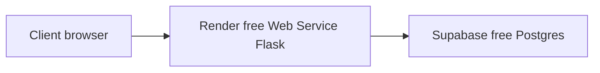
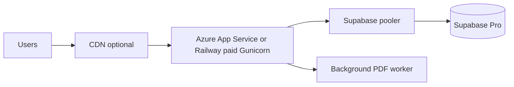

# Hosting roadmap (demo → 10,000 users)

Short reference. Full steps: [DEPLOYMENT.md](../DEPLOYMENT.md).

## Free client demo (today)

- **Render:** upload, mapping, workflow, PDF (with wake-up delay).
- **Supabase:** users, sessions, mapped data.
- **Not Vercel** for full file workflow (upload size + timeout limits).

## When funded (production sketch)

| Stage | Users (indicative) | Hosting |
|-------|-------------------|---------|
| Demo | Client meetings | Render free + Supabase free |
| Pilot | 10–200 | Render Starter / Azure B1 + Supabase Pro |
| Growth | 2k–10k registered | Azure scale-out + pooler + job queue |
| Scale | 10k+ MAU | Replicas, monitoring, archival |

## South Africa latency

Prefer **Azure South Africa North** (Johannesburg) for production when budget allows. Render free regions are usually US/EU — acceptable for demos, less ideal for daily 10k-user production.

## Repo artifacts

- `render.yaml` — free web deploy
- `scripts/add_session_queue_indexes.sql` — queue performance
- `GET /api/transactions/pending?limit=&offset=` — pagination
